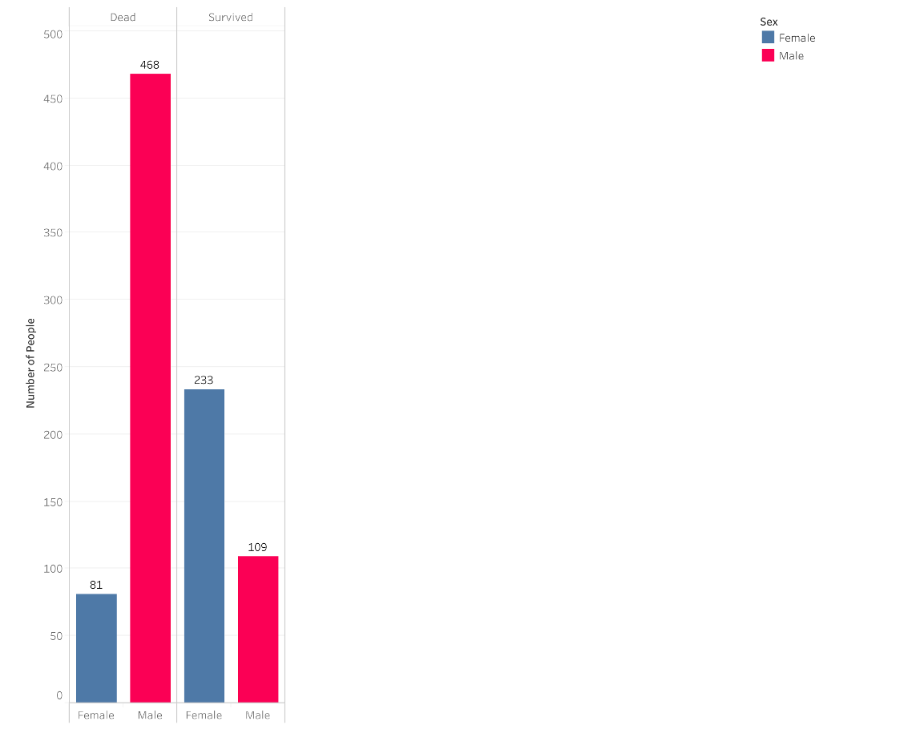
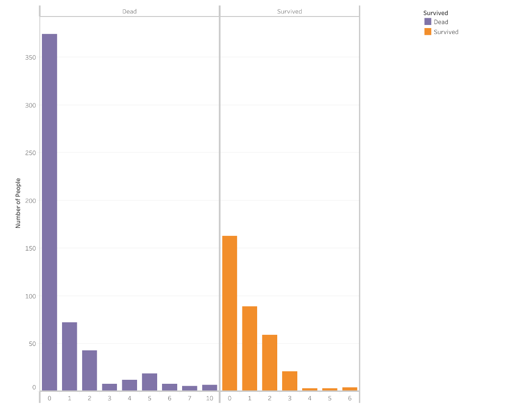
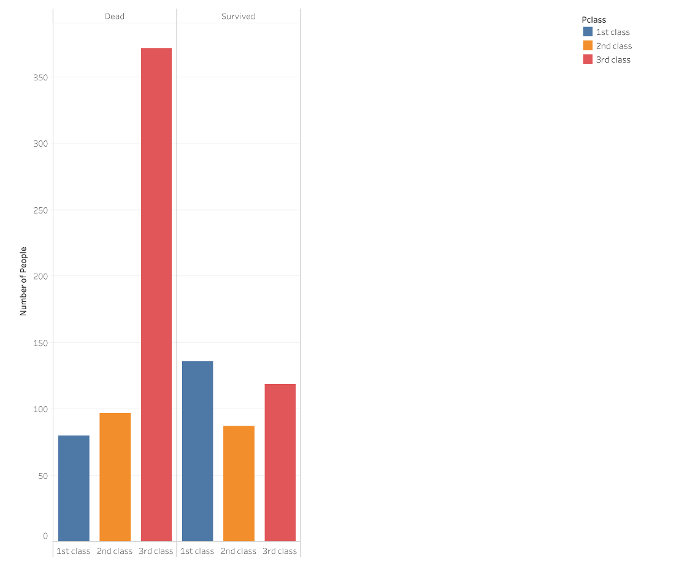

# Titanic-kaggle-

## Survival by Sex

From the above graph, we can see that Males were more likely to not survive.

## Survival by Family Size
Family size was calculated using the following formula:
* FamSize = SibSp + Parch + 1

If FamSize = 1 it means that the passenger boarded alone. 
From the graph, we can see that passengers who boarded alone were more likely to not survive.

Also based on the image below, it can be seen that third class passengers are more likely to not survive due to the position of their cabins.

Based on the dataset provided, this conjecture is present

Age was bucketised in the following manner:
* 0: Child (0-12 years), 
* 1: Adolescence (13-18 years), 
* 2: Adult (19-59 years) and 
* 3: Senior Adult (60 years and above)  

decision tree was used as a classifier with the following equation:
* Pclass + Sex + Age + FamSize
